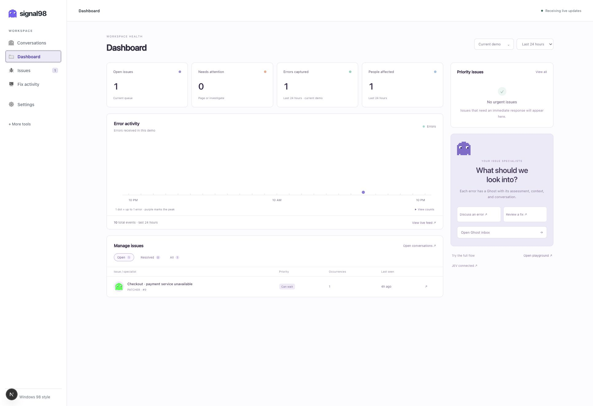

# Signal98

Signal98 captures errors from your app, groups repeat occurrences into issues, and uses **JEV** to assess their impact. Each issue has a **Ghost conversation** where you can investigate the error and prepare a code fix. A separate dashboard shows actual error activity, affected people, and priorities.

The modern interface is the default. The ghost icon and sidebar stay visible; Windows 98 styling is available through a switch.



*The live dashboard with a captured demo error.*

## Install and start Signal98

This repository contains the server and the SDK. You run your own Signal98 instance; there is no separate Signal98 account or hosted key-issuing service required for this setup.

Use Node.js 22.22 or newer, npm, and Git (development is tested with Node.js 22.22.3). The monitor needs Node's built-in `node:sqlite`; the SDK itself supports Node 18+ and browsers.

From the repository root:

```bash
npm run dev
```

The first run installs dependencies, builds the SDK and its downloadable npm package, and starts:

- **Monitor:** <http://localhost:3001>
- **Demo shop:** <http://localhost:3000/demo>

On a new database, the monitor opens a **setup walkthrough**. Existing installations keep their current workspace. Open **Settings → Setup walkthrough** to run it again. Setup progress is stored on the server, so you can continue later.

The walkthrough:

1. Names your app and shows its Signal98 project key.
2. Accepts and checks a private TypeSafe/JEV key, or lets you continue with labelled keyword classification.
3. Explains Ghost's model connection and optionally saves the folder containing your app's source.
4. Provides an install command and React, Next.js, or script-tag snippets filled in for your app.
5. Waits for a uniquely tagged test error sent from that app, then explains how to use its conversation and prepare a fix.

You can finish without verification. The guide will not claim an app is connected merely because old events or the bundled demo are present.

## How do I get a Signal98 API key?

**Signal98 generates project keys itself.** You do not obtain one from TypeSafe.

1. Start your Signal98 instance and open its monitor.
2. Copy the key shown by the setup walkthrough, or go to **Settings → Connect your app → Project API key**.
3. Use that value as `apiKey` in your app's SDK initialization. Set `host` to the address of this Signal98 server.

The bundled local-development project uses `s98_pk_local_dev` so the demo works immediately. It is a predictable demo key. Before exposing an installation beyond local development, use **Rotate key** in the same settings section, or configure `SIGNAL98_DEFAULT_KEY` before creating the database. Rotation invalidates the previous key; update every SDK installation, including the demo, that used it.

**Settings → Projects → Create project** creates another project with a randomly generated `s98_pk_…` key. Each project has its own events and settings. At present the desktop UI displays the first project; the admin API can inspect other projects with `?project=<id>`. Use the first project's key for the guided UI flow until project switching is implemented.

### The three credentials are different

| Credential | Issued by | Where it belongs | What it does |
|---|---|---|---|
| Signal98 project key (`s98_pk_…`) | Your Signal98 server | Your app's SDK / browser code | Sends events to its project and reads evaluated feature flags. Does not grant admin access. |
| TypeSafe/JEV API key | Your [TypeSafe console](https://console.typesafe.ai) | Signal98 server only | Pays for and authorizes JEV classification requests. Never put it in your React app. |
| Admin token (`SIGNAL98_ADMIN_TOKEN`) | You choose it | Signal98 server; entered at monitor login | Protects the monitor's admin API and saved monitoring data. It is not an SDK key. |

Ghost uses a separate model connection. The JEV key does not enable generative chat or code editing.

## Connect a React app

Keep Signal98 running. In **your React app's folder**, install the package built and served by this Signal98 instance:

```bash
npm install "http://localhost:3001/downloads/signal98-0.2.0.tgz"
```

This installs this checkout's actual SDK; it does not assume a public `signal98` npm release. If the package URL returns 404, run `npm run build` in Signal98's `sdk/` folder. For a remote installation, replace `localhost:3001` with your Signal98 server's reachable address. You can also build a local archive:

```bash
npm pack /path/to/Signal98/sdk
npm install ./signal98-0.2.0.tgz
```

Initialize once before rendering, for example in a Vite app's `src/main.jsx`. Preserve any existing providers, router, and styles in your app:

```jsx
import { createRoot } from "react-dom/client";
import { init } from "signal98";
import { createErrorBoundary } from "signal98/react";
import App from "./App";

const client = init({
  host: "http://localhost:3001",
  apiKey: "YOUR_SIGNAL98_PROJECT_KEY",
  service: "my-react-app",
  environment: "development",
});
const SignalBoundary = createErrorBoundary(client);

createRoot(document.getElementById("root")).render(
  <SignalBoundary fallback={<p>Something went wrong.</p>}>
    <App />
  </SignalBoundary>
);
```

The SDK automatically captures uncaught browser errors, unhandled promise rejections, failed requests, and supported activity signals. The boundary captures React render errors. Errors you catch yourself need `captureException`.

### Send a test error

Add a temporary button inside a React component:

```jsx
import { captureException } from "signal98";

export function Signal98Test() {
  return (
    <button onClick={() => {
      captureException(new Error("Test error from my React app"));
    }}>
      Send test error
    </button>
  );
}
```

Click it and open **Conversations** in Signal98. The new issue should arrive, receive a classification, and get a Ghost specialist. Repeated errors with the same fingerprint stay in the same issue and conversation.

When using the setup walkthrough, use **its generated test snippet** instead: it contains a setup marker that lets the guide verify this specific connection. A generic error still appears in Conversations but does not complete the guide's tagged test.

If nothing arrives, check the SDK's `host` and project key, the app name in the guide, browser network requests to `/api/ingest`, and the current demo/history filter. A 401 from ingest means the project key is wrong or has been rotated.

## Connect Next.js

Choose **Next.js** in the walkthrough for complete, copyable files:

- A client-side `SignalProvider` initializes the browser SDK and wraps the app in its React error boundary. Add it around the children in `app/layout.jsx`.
- Root `instrumentation.js` initializes the Node SDK in `register()` and reports errors from `onRequestError()` using `captureException()` and `flush()`.

**Both halves matter.** A server-rendering error can occur before any browser code runs. A browser-only integration cannot capture that failure. The provided server integration targets Next.js App Router with the Node runtime; it does not cover Edge-runtime server errors. Merge with existing instrumentation rather than replacing it.

The working example is in [`playground/app/signal.jsx`](playground/app/signal.jsx) and [`playground/instrumentation.js`](playground/instrumentation.js).

## Connect a plain website

The setup walkthrough can generate a script tag instead of an npm install:

```html
<script
  src="http://localhost:3001/s98.js"
  data-host="http://localhost:3001"
  data-key="YOUR_SIGNAL98_PROJECT_KEY"
  data-service="my-website"
  defer
></script>
```

The browser API is available as `window.signal98` after the script loads. For a hosted website, use your reachable HTTPS Signal98 address in both places.

## Connect JEV

Get a private API key from the [TypeSafe console](https://console.typesafe.ai). In the walkthrough's **JEV** step, paste it and choose **Save & check key**. The server makes a small classification request using that account. A rejected or unreachable key does not replace a working key.

A successful new key is stored in `desktop/data/credentials.json` with owner-only file permissions, stays out of Git, and takes effect immediately. The browser receives connection status, never the saved key. If a custom data directory is configured, the file lives there instead. Wizard-saved credentials take precedence over an environment-provided JEV key on restart.

For environment-based configuration, copy `desktop/.env.local.example` to `desktop/.env.local` if that file does not already exist, and set:

```dotenv
TYPESAFE_API_KEY=your_private_typesafe_key
```

Restart after editing environment settings. If you previously saved a key through the wizard, update that key through the wizard or remove the saved credential file before relying on the environment value.

Without JEV, issues use an explicitly labelled keyword fallback. A successful key check is shown separately from merely having a configured key. Existing heuristic issues are upgraded in the background when JEV becomes available.

JEV classifies grouped issues, not every occurrence. Repeated events reuse the assessment, with reclassification when an issue regresses or grows enough. JEV does not generate the Ghost's chat replies.

## Chat with Ghost and prepare a fix

Ghost uses the existing **Claude Code CLI** login when available. An OpenAI-compatible model configured through `LLM_API_KEY`, `LLM_BASE_URL`, and `LLM_MODEL` can provide chat from captured context. Code-editing runs require Claude Code on the Signal98 server. A missing chat model is displayed explicitly.

Set **Settings → Fix assistant → Repository path** to your app's Git repository on the machine running Signal98. The walkthrough also offers this setting. Do not leave it pointing at the bundled demo when asking Ghost to fix a different app.

1. Open an issue's conversation and discuss the error.
2. Choose **Prepare fix**. The coding agent receives the captured error, JEV assessment, and recent conversation.
3. Review the proposed diff, then use **Apply fix** if appropriate.

Chat is read-only. The coding agent works in an isolated Git worktree; the original app changes only when a proposed fix is applied. Its snapshot includes current tracked and non-ignored untracked work without changing your staging. Applying a diff preserves staging and rejects conflicting edits. If the issue returns after a fix, it reopens with the earlier attempt available as context.

Model calls start when you send a message or request a fix. Hundreds of repeated errors do not automatically launch hundreds of chat agents. Automatic fix mode is a separate, opt-in setting with attempt and daily-run limits.

## Running beyond your own computer

`localhost` always means the computer making the request. Visitors to a deployed app cannot send events to your laptop through a localhost URL. Host Signal98 at a reachable HTTPS address, use that address in SDK configuration, and set an admin token before exposing the monitor. The SDK project key remains public; JEV keys, model keys, and the admin token remain private.

Persist the server data directory: it holds the SQLite database, setup progress, conversations, and any wizard-saved credential. Keep backups private. Production installation also needs the built SDK assets: run the SDK build before building and starting the monitor. See [`desktop/.env.local.example`](desktop/.env.local.example) for server configuration.

## Repository and checks

- `sdk/`: capture package, React error boundary, browser/Node integrations, and standalone bundles.
- `desktop/`: Next.js monitor, API, SQLite storage, classification, conversations, and code-fix execution.
- `playground/`: instrumented demo app with deliberate errors.
- [`docs/PROTOCOL.md`](docs/PROTOCOL.md): SDK and admin API contracts.
- [`docs/UI.md`](docs/UI.md): interface behavior and shared components.

```bash
npm test --prefix sdk
npm test --prefix desktop
```

Backend tests use isolated data and stub model requests. Do not run a production build in the same `.next` directory while the development monitor is running.
